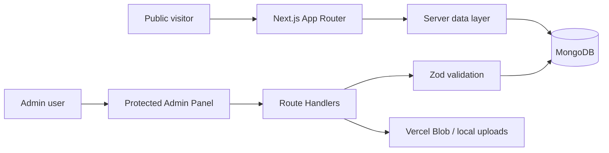

# Workweb Blog

A full-stack Thai blog platform built with Next.js App Router, MongoDB, and TypeScript. The project demonstrates authenticated content management, moderated comments, validated image uploads, server-side pagination, and production-oriented security controls.

ระบบจัดการบทความภาษาไทยแบบ Full Stack มีหน้าเว็บไซต์สาธารณะและ Admin Panel สำหรับดูแลบทความ รูปภาพ และความคิดเห็น

## Highlights

- Published/draft workflow with searchable, paginated public content
- JWT admin sessions stored in secure `httpOnly` cookies
- Comment moderation with pending, approved, and rejected states
- Shared Zod/Mongoose validation and Thai-language comment rules
- Image uploads to Vercel Blob in production or local storage during development
- File signature verification, MIME allowlist, 5 MB limit, and randomized filenames
- Automated lint, unit tests, production build, and GitHub Actions CI

## Architecture



Images are embedded in a blog document because they are bounded and read with the article. Comments use a separate collection because they can grow independently and need cross-blog moderation queries.

## Tech stack

| Area | Technology |
| --- | --- |
| Framework | Next.js 16, React 19, App Router |
| Language | TypeScript (strict mode) |
| Database | MongoDB, Mongoose |
| Authentication | `jose` JWT, `bcryptjs`, secure cookies |
| Validation | Zod and Mongoose schemas |
| Styling | Tailwind CSS 4 |
| Storage | Vercel Blob with local development fallback |
| Quality | ESLint, Node test runner via `tsx`, GitHub Actions |

## Getting started

Requirements: Node.js 22 (recommended) and MongoDB.

```bash
git clone <your-repository-url>
cd workweb
npm ci
cp .env.example .env.local
```

Update `.env.local` with your own values. Generate a JWT secret with:

```bash
openssl rand -base64 32
```

Seed a development admin and sample articles, then start the app:

```bash
npm run seed
npm run dev
```

- Public site: [http://localhost:3000](http://localhost:3000)
- Admin panel: [http://localhost:3000/admin](http://localhost:3000/admin)

The seed command requires `ADMIN_PASSWORD` to contain at least 12 characters. Credentials are never printed or committed.

## Environment variables

| Variable | Required | Purpose |
| --- | --- | --- |
| `MONGODB_URI` | Yes | MongoDB connection string |
| `JWT_SECRET` | Yes | Session signing secret, minimum 32 characters |
| `ADMIN_USERNAME` | Seed only | Initial admin username |
| `ADMIN_PASSWORD` | Seed only | Initial admin password, minimum 12 characters |
| `BLOB_READ_WRITE_TOKEN` | Production uploads | Vercel Blob access token |

See [`.env.example`](.env.example) for a safe template.

## Commands

```bash
npm run dev      # development server
npm run lint     # static analysis
npm test         # unit tests
npm run build    # optimized production build
npm run check    # lint + tests + build
npm run seed     # reset and create local sample data
```

## Main API routes

| Method and route | Access | Purpose |
| --- | --- | --- |
| `POST /api/auth/login` | Public | Authenticate an admin |
| `POST /api/auth/logout` | Admin | Clear the session |
| `GET/POST /api/blogs` | Admin | List or create articles |
| `GET/PUT/DELETE /api/blogs/:id` | Admin | Read, update, or delete an article |
| `PATCH /api/blogs/:id/publish` | Admin | Publish or unpublish an article |
| `POST /api/comments` | Public | Submit a pending comment |
| `GET /api/comments` | Admin | List comments by status |
| `PATCH /api/comments/:id` | Admin | Moderate a comment |
| `POST /api/upload` | Admin | Validate and upload an image |

## Project structure

```text
src/
├── app/             # Pages, layouts, and API route handlers
├── components/      # Reusable client and server UI
├── lib/             # Auth, database, validation, and shared utilities
├── models/          # Mongoose schemas and inferred types
└── proxy.ts         # Admin route protection
tests/               # Focused unit tests for security and validation rules
scripts/seed.ts      # Idempotent local demo-data setup
```

## Security notes

- Admin APIs verify the signed session independently of page-level route protection.
- JWT issuer, audience, algorithm, expiry, and required claims are validated.
- There is no fallback production secret; misconfiguration fails closed.
- Login work is intentionally similar for existing and unknown usernames to reduce timing leakage.
- Redirects after login are restricted to internal admin paths.
- User input is validated on the server even when client-side validation is present.
- Uploaded file contents are checked against their declared image type.

For an internet-facing deployment, add infrastructure-level rate limiting to login, comments, and uploads (for example through a reverse proxy or platform firewall).

## Deployment

The application is designed for Vercel with MongoDB Atlas and Vercel Blob. Configure the environment variables in the hosting platform before deployment. Local filesystem uploads are intended only for development because serverless filesystems are ephemeral.
